# Food Calorie App Architecture & Implementation Guide

## 🎯 Overview

This document outlines the complete architecture and implementation of a food calorie tracking app that integrates AI-powered food recognition with user profile data to provide personalized nutrition recommendations.

## 🏗️ Architecture Decision: Hybrid Data Approach

### ✅ **Use Profile Data Directly (PostgreSQL)**

- **User profiles** (age, weight, height, goal, activity level, gender)
- **Meal tracking** (food entries, calories, nutrition)
- **Daily targets** (calorie goals, exercise recommendations)
- **Progress tracking** (consumption history, goal progress)

**Why Direct Usage:**

- ✅ Structured data with exact values needed for calculations
- ✅ No similarity search required - we want exact user data
- ✅ Fast lookups with primary key access
- ✅ Relational integrity with user accounts and meal history

### 🔮 **Vector DB for Food Intelligence (Optional Future Enhancement)**

- **Food embeddings** for similarity search
- **Recipe recommendations** based on dietary preferences
- **Meal planning** with AI-generated suggestions
- **Nutrition knowledge** for enhanced recommendations

## 🎨 System Architecture Diagram

```mermaid
graph TB
    %% User Interface
    U[📱 User Takes Food Photo] --> CV[🤖 Computer Vision API]

    %% AI Processing
    CV --> FI[🔍 Food Identification]
    FI --> VDB[(🗂️ Vector DB<br/>Food Embeddings)]
    FI --> CD[📊 Calorie Detection]

    %% Data Sources
    VDB --> FR[🥗 Food Recommendations]
    CD --> CC[⚖️ Calorie Calculator]

    %% User Profile (Direct DB Access)
    PDB[(📊 PostgreSQL<br/>User Profiles)] --> CC
    PDB --> ER[🏃 Exercise Recommendations]

    %% Business Logic
    CC --> BL[🧠 Business Logic Engine]
    FR --> BL
    ER --> BL

    %% Results
    BL --> R1[📈 Daily Calorie Target]
    BL --> R2[🥙 Meal Suggestions]
    BL --> R3[🏋️ Exercise Plan]
    BL --> R4[📊 Progress Tracking]

    %% Storage
    R1 --> MH[(📝 Meal History)]
    R4 --> MH
```



## 📊 Database Schema

### 1. Extended User Tables

#### `meals` Table

```typescript
export const meals = pgTable('Meals', {
  Id: serial('Id').primaryKey(),
  UserId: integer('UserId')
    .notNull()
    .references(() => users.Id),
  ImageUrl: varchar('ImageUrl', { length: 500 }),
  FoodName: varchar('FoodName', { length: 255 }).notNull(),
  EstimatedCalories: decimal('EstimatedCalories', { precision: 8, scale: 2 }).notNull(),
  Confidence: decimal('Confidence', { precision: 3, scale: 2 }), // AI confidence score
  NutritionData: jsonb('NutritionData'), // Store detailed nutrition as JSON
  MealType: varchar('MealType', { length: 50 }), // breakfast, lunch, dinner, snack
  CreatedAt: timestamp('CreatedAt').defaultNow(),
})
```

#### `dailyTargets` Table

```typescript
export const dailyTargets = pgTable('DailyTargets', {
  Id: serial('Id').primaryKey(),
  UserId: integer('UserId')
    .notNull()
    .references(() => users.Id),
  Date: timestamp('Date').notNull(),
  TargetCalories: decimal('TargetCalories', { precision: 8, scale: 2 }).notNull(),
  ConsumedCalories: decimal('ConsumedCalories', { precision: 8, scale: 2 }).default('0'),
  RecommendedExerciseMinutes: integer('RecommendedExerciseMinutes'),
  ActualExerciseMinutes: integer('ActualExerciseMinutes').default(0),
  CreatedAt: timestamp('CreatedAt').defaultNow(),
})
```

#### `exerciseRecommendations` Table

```typescript
export const exerciseRecommendations = pgTable('ExerciseRecommendations', {
  Id: serial('Id').primaryKey(),
  UserId: integer('UserId')
    .notNull()
    .references(() => users.Id),
  ExerciseType: varchar('ExerciseType', { length: 100 }).notNull(),
  Duration: integer('Duration').notNull(), // minutes
  CaloriesBurned: decimal('CaloriesBurned', { precision: 8, scale: 2 }),
  Date: timestamp('Date').notNull(),
  CreatedAt: timestamp('CreatedAt').defaultNow(),
})
```

## 🧠 Core Business Logic

### Calorie Calculation Engine

#### BMR Calculation (Mifflin-St Jeor Equation)

```typescript
function calculateBMR(weight: number, height: number, age: number, gender: string): number {
  if (gender === 'MALE') {
    return 10 * weight + 6.25 * height - 5 * age + 5
  } else {
    return 10 * weight + 6.25 * height - 5 * age - 161
  }
}
```

#### Daily Calorie Needs

```typescript
function calculateDailyCalories(bmr: number, activityLevel: string): number {
  const multipliers = {
    LOW: 1.2, // Sedentary
    MODERATE: 1.55, // Moderately active
    HIGH: 1.725, // Very active
  }
  return bmr * (multipliers[activityLevel] || 1.55)
}
```

#### Goal-Based Adjustments

```typescript
function adjustForGoal(dailyCalories: number, goal: string): number {
  switch (goal) {
    case 'LOSE_FAT':
      return dailyCalories - 500 // 500 calorie deficit for ~1lb/week loss
    case 'GAIN_WEIGHT':
      return dailyCalories + 500 // 500 calorie surplus for weight gain
    case 'MAINTAIN':
    default:
      return dailyCalories
  }
}
```

## 🤖 AI Integration

### Enhanced RAG System for Food Analysis

#### Food Image Analyzer Class

```python
class FoodImageAnalyzer:
    def __init__(self):
        genai.configure(api_key=settings.GEMINI_API_KEY)
        self.model = genai.GenerativeModel(
            model_name="gemini-1.5-flash",
            generation_config={
                "temperature": 0.3,  # Lower temperature for consistent analysis
                "max_output_tokens": 1024,
            }
        )

    async def analyze_food_image(self, image_path: str) -> dict:
        # Returns structured nutrition data with confidence scores

    async def get_food_recommendations(self, user_profile: dict, current_nutrition: dict) -> dict:
        # Generates personalized food recommendations
```

#### AI Response Format

```json
{
  "foodName": "Grilled Chicken Breast",
  "calories": 231,
  "confidence": 0.89,
  "nutrition": {
    "protein": 43.5,
    "carbs": 0,
    "fat": 5.0,
    "fiber": 0,
    "sugar": 0
  },
  "portionSize": "100g",
  "ingredients": ["chicken", "herbs", "spices"],
  "mealType": "lunch",
  "healthScore": 8,
  "tips": ["High protein, great for muscle building"]
}
```

## 🔄 Data Flow

### Complete Food Analysis Flow

1. **User uploads food image** via React interface
2. **Server action** handles file upload and validation
3. **Image uploaded** to storage (Supabase/AWS S3/Cloudinary)
4. **AI analysis** processes image using Gemini Vision API
5. **Profile data fetched** directly from PostgreSQL
6. **Calorie calculations** performed using user's profile
7. **Meal saved** to database with nutrition details
8. **Recommendations generated** based on daily progress
9. **UI updated** with personalized insights

## 📱 User Interface

### Food Scanner Page Features

- **Image upload** with meal type selection
- **Real-time preview** of selected food image
- **AI analysis** with loading states and confidence scores
- **Nutrition breakdown** with macro nutrients display
- **Daily progress** tracking with visual progress bars
- **Exercise recommendations** based on calorie balance
- **Meal suggestions** for remaining calories
- **Error handling** for failed analyses

### UI Components Structure

```
Food Scanner Page
├── Image Upload Section
│   ├── Meal Type Selector
│   ├── File Input
│   ├── Image Preview
│   └── Analyze Button
└── Results Section
    ├── Food Identification
    ├── Nutrition Breakdown
    ├── Daily Progress
    ├── Exercise Recommendations
    └── Meal Suggestions
```

## 🛠️ Implementation Files

### File Structure

```
apps/web/
├── db/schema/
│   └── meals.ts                    # Database schema for meal tracking
├── core/food/
│   └── analyze-food.ts             # Core business logic
├── app/(main)/
│   ├── actions/
│   │   └── analyze-food.ts         # Server actions
│   └── food-scanner/
│       └── page.tsx                # UI component
└── rag/
    └── food_image_analyzer.py      # Enhanced AI integration
```

### Key Functions

#### Core Analysis Function

```typescript
export async function analyzeFoodAndRecommend(
  imageUrl: string,
  mealType: 'breakfast' | 'lunch' | 'dinner' | 'snack'
): Promise<{
  foodAnalysis: FoodAnalysisResult
  dailyRecommendation: DailyRecommendation
  success: boolean
  error?: string
}>
```

#### Server Action

```typescript
export async function analyzeFood(formData: FormData) {
  // Handles image upload, AI analysis, and database operations
}
```

## 🔧 Setup Instructions

### 1. Database Migration

```bash
cd apps/web
pnpm db:generate
pnpm db:migrate
```

### 2. Environment Variables

```env
# .env.local
GOOGLE_CLIENT_ID=your_google_client_id
GOOGLE_CLIENT_SECRET=your_google_client_secret
NEXTAUTH_SECRET=your_nextauth_secret
NEXTAUTH_URL=http://localhost:3000
SUPABASE_DATABASE_URL=your_database_url
GEMINI_API_KEY=your_gemini_api_key
```

### 3. Install Dependencies

```bash
# Python dependencies for RAG system
cd apps/web/rag
pip install -r requirements.txt

# Node.js dependencies
cd apps/web
pnpm install
```

### 4. Configure Image Storage

```typescript
// Implement in apps/web/app/(main)/actions/analyze-food.ts
async function uploadImageToStorage(file: File): Promise<string> {
  // Options:
  // - Supabase Storage
  // - AWS S3
  // - Cloudinary
  // - Vercel Blob Storage
}
```

### 5. Add Navigation

```typescript
// In app-sidebar.tsx
{ title: "Food Scanner", url: "/food-scanner", icon: Camera }
```

## 🎯 Key Features Delivered

### ✅ **Core Functionality**

- [x] AI-powered food recognition using Google Gemini
- [x] Personalized calorie calculations using BMR formulas
- [x] Exercise recommendations based on calorie balance
- [x] Meal tracking with detailed nutrition breakdowns
- [x] Progress monitoring with daily targets
- [x] Clean, modern UI with real-time feedback

### ✅ **Technical Architecture**

- [x] TypeScript throughout for type safety
- [x] Server actions for secure backend operations
- [x] Absolute path imports for maintainability
- [x] Drizzle ORM for type-safe database operations
- [x] NextAuth integration for user authentication
- [x] Responsive design with Tailwind CSS

### ✅ **Data Strategy**

- [x] Direct PostgreSQL usage for structured profile data
- [x] Efficient BMR and calorie calculations
- [x] Proper database relationships and foreign keys
- [x] JSON storage for flexible nutrition data
- [x] Scalable schema for future enhancements

## 🚀 Future Enhancements

### Vector Database Integration

- **Food similarity search** - "Find foods similar to chicken breast"
- **Recipe recommendations** - AI-generated meal plans
- **Nutrition knowledge base** - Enhanced dietary guidance
- **Meal planning** - Weekly menu suggestions

### Advanced Features

- **Barcode scanning** for packaged foods
- **Recipe creation** from multiple ingredients
- **Social features** for sharing meals and progress
- **Integration with fitness trackers** for exercise data
- **Nutritionist chat** powered by AI

### Analytics & Insights

- **Weekly/monthly nutrition reports**
- **Goal progress visualization**
- **Personalized insights** based on eating patterns
- **Health trend analysis** over time

## 📊 Benefits Achieved

### **User Experience**

- ✅ **Instant food recognition** with high accuracy
- ✅ **Personalized recommendations** based on individual goals
- ✅ **Visual progress tracking** with intuitive interfaces
- ✅ **Smart exercise suggestions** for calorie balance

### **Technical Benefits**

- ✅ **Scalable architecture** for future growth
- ✅ **Type-safe development** with comprehensive TypeScript
- ✅ **Maintainable codebase** with absolute imports
- ✅ **Secure authentication** with NextAuth integration

### **Business Value**

- ✅ **Comprehensive solution** covering nutrition and fitness
- ✅ **AI-powered accuracy** for food recognition
- ✅ **Personalized experience** driving user engagement
- ✅ **Extensible platform** for additional health features

---

## 📝 Notes

This architecture provides a solid foundation for a comprehensive food calorie tracking application. The hybrid approach of using direct database access for user profiles while leveraging AI for food analysis ensures both performance and accuracy.

The system is designed to be:

- **Scalable** - Can handle growing user base and feature additions
- **Maintainable** - Clean code structure with TypeScript safety
- **Extensible** - Easy to add new features like barcode scanning or social features
- **Accurate** - Uses established BMR formulas and AI-powered food recognition

**Created:** $(date)
**Last Updated:** $(date)
**Version:** 1.0.0
